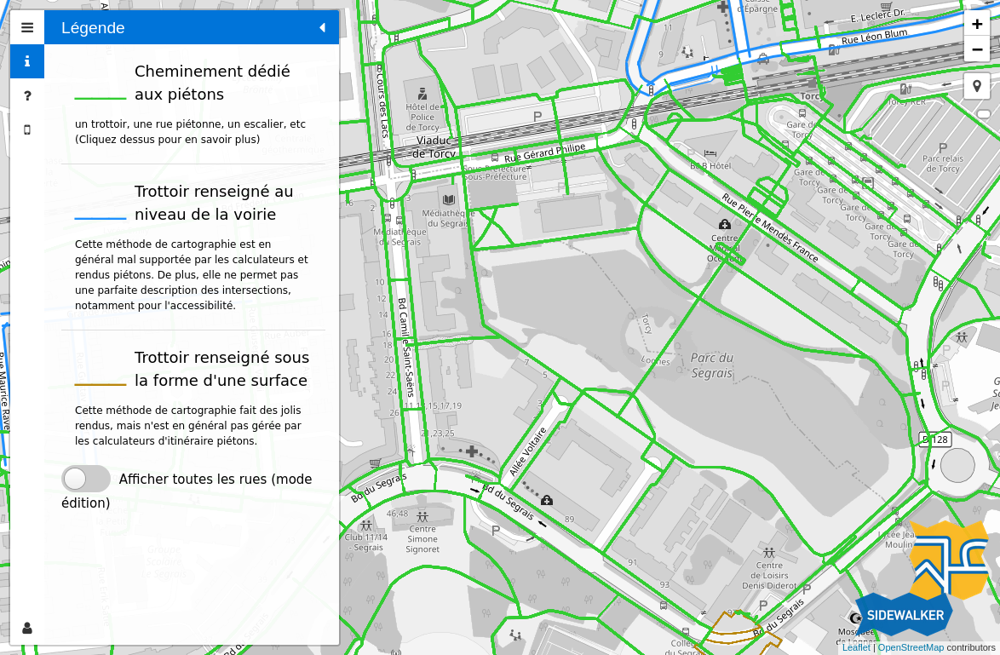

# sidewalker

A tool to check the sidewalks in OSM // Un outil pour vérifier les trottoirs et cheminements piétons dans OSM

# Credits

The code in this repository is under the GPL-3.0 license. 

It is heavily based on the [OSM bus lanes editor](https://github.com/Jungle-Bus/bus-lanes) (Copyright (c) 2017 zetx16)
